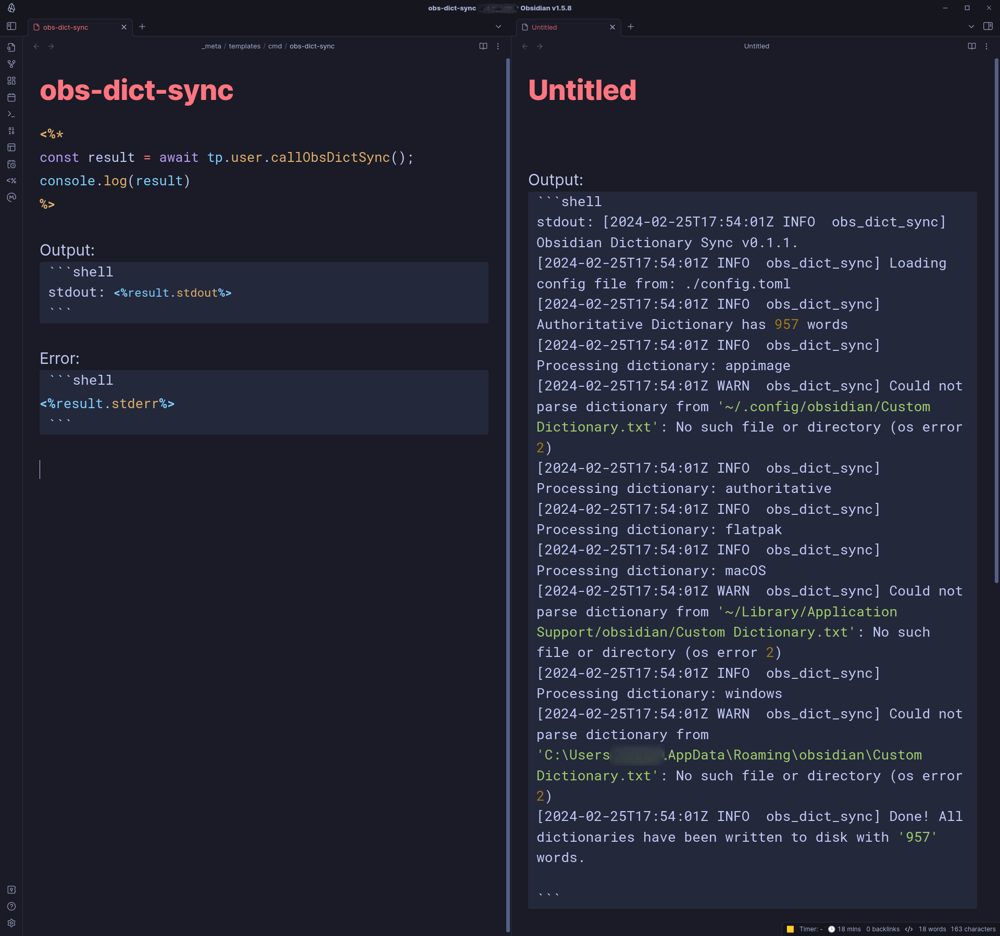

# Obsidian Dictionary Sync Tool (rust edition) <!-- omit in toc -->

This is a re-implementation of the [python tool](https://github.com/kquinsland/obsidian-dictionary-sync-tool) I built.

<!-- START doctoc generated TOC please keep comment here to allow auto update -->
<!-- DON'T EDIT THIS SECTION, INSTEAD RE-RUN doctoc TO UPDATE -->

- [How it works](#how-it-works)
  - [Notes about Obsidian `Custom Dictionary.txt` files](#notes-about-obsidian-custom-dictionarytxt-files)
- [Install](#install)
- [Using](#using)
  - [Configuration](#configuration)
- [Running from within obsidian](#running-from-within-obsidian)
- [TODO](#todo)

<!-- END doctoc generated TOC please keep comment here to allow auto update -->

I created the rust version for two reasons:

- Managing python virtual environments cross platform is a [pain in the ass](https://github.com/kquinsland/obsidian-dictionary-sync-tool?tab=readme-ov-file#windows) and I never really enjoyed using the python tool on my windows hosts.
- It seems like it's a right of passage / requirement that every new [rustacean](https://rustacean.net/) do their part to keep the ["so then I re-wrote it in Rust"](https://transitiontech.ca/random/RIIR) meme alive.

Rather than deal with python virtual environments on Windows or figure out how to bundle the python tool + runtime into a single executable binary for windows/linux platforms I figured a single purpose small binary would be ideal.

## How it works

When you tell Obsidian to add a new word to it's "spellcheck ignore" list, it writes that word out to a text file named `Custom Dictionary.txt`.

The location of this text file changes based on the operating system and how Obsidian was installed.
In all cases, the file location isn't intuitive or easily accessible so it's not trivial to synchronize the dictionary across multiple machines.
Furthermore, the last line of the file has a md5 hash so adding new words to the dictionary isn't easily done by hand.

This is a very simple program that attempts to find the `Custom Dictionary.txt` file(s) on the host system and merges the words found within each into a single "authoritative" set of words.

Each dictionary file is then replaced with the authoritative set of words and the correct hash.
To make synchronization easier, the authoritative set of words is written to a single file that can be easily synchronized across multiple machines.

A bit more documentation [here](https://forum.obsidian.md/t/custom-dictionary-txt-sync-tool/51905) and [here](https://github.com/kquinsland/obsidian-dictionary-sync-tool).

### Notes about Obsidian `Custom Dictionary.txt` files

In testing, Obsidian does not expect any external programs to modify the custom dictionary file.
This means that only the changes Obsidian makes to the file are applied immediately.
All other changes are ignored - or, in some cases overwritten - until Obsidian is restarted.

This has a few implications:

- **The `Custom Dictionary.txt` file will not exist until you add at least one word to it from within obsidian.** If you run this tool and it emits an error about the dictionary file not existing for a platform you expect it to be on, you'll need to add a word to the dictionary from within Obsidian and then run the tool again.

- **If you use this tool to add new words to the custom dictionary file, you will need to restart Obsidian before the changes are picked up.**

- **Any changes made to the custom dictionary file that are not made by Obsidian will be overwritten when Obsidian makes changes to the file.** If you run this tool and then add a word to the custom dictionary from within Obsidian, the changes made by this tool will be overwritten. You should always run this tool _after_ you've made changes to the custom dictionary from within Obsidian and then restart Obsidian.

## Install

> **Note**
> You will need `curl` and `jq` and `wget` installed.

```shell
//TODO: need to squash commit and force push to drop history and then make public / test this out.
❯ curl -s https://api.github.com/repos/kquinsland/obsidian-dict-sync/releases/latest | jq -r '.assets[] | select(.name | startswith("obs-dict-sync")) | .browser_download_url' | wget -i -
```

## Using

There is no GUI, run from terminal/shell.

```shell
❯ ./dict-sync.linux.x86_64 -h
A quick and dirty tool to synchronize Obsidian.md user dictionaries.

Usage: dict-sync.linux.x86_64 [OPTIONS]

Options:
  -c, --config-file-path <CONFIG_FILE_PATH>
          Location of configuration.toml file [env: ODS_CFG_FILE=] [default: ./config.toml]
  -v, --verbose
          Enable verbose logging [env: ODS_LOG_VERBOSE=]
  -h, --help
          Print help (see more with '--help')
  -V, --version
          Print version
```

### Configuration

I _strongly_ believe that tools should come with / generate their own "sane-defaults" configuration file.

You can see a "complete" configuration file [here](./config/example.toml) or just _run_ the tool and a copy of the configuration file will be written to disk.

```shell
❯ ls config.toml
ls: cannot access 'config.toml': No such file or directory

# Run tool w/o a config file present and one will be generated for you
❯ dict-sync
<...>

❯ ls config.toml
config.toml
```

If you need to change where the config file lives, there is a [command line flag for that](#using).

## Running from within obsidian

As it turns out, it is possible to run system binaries from within Obsidian using the [`user scripts`](https://silentvoid13.github.io/Templater/user-functions/script-user-functions.html) function from the extremely powerful [Templater](https://silentvoid13.github.io/Templater/) plugin.

To pull this off, you'll need to write a small nodejs script that can spawn the system binary and capture the output. Here's the code that I use.

Comments are inline to explain what's going on if it's not clear.
You likely won't need to change anything _other than_ the paths to the various obsidian dictionary sync binaries in the `binaryPathMap` object.

```js
const { spawn } = require('child_process');
const os = require('os');
// Import the fs module to check if the file exists
const fs = require('fs');
// Import the path module to get the directory name of the binary
const path = require('path');

async function callObsDictSync() {
  // 'darwin', 'linux', 'win32', etc.
  const platform = os.platform();
  // 'x64', 'arm64', etc.
  const arch = os.arch();

  // Map platform and architecture to binary paths
  // The path(s) below are examples and should be replaced with the actual path to the binary which will  depend on where you have it installed on your system(s)
  const binaryPathMap = {
    'darwin': {
      'x64': '/Users/youMacUserNameHere/Notes/obsidian/dict-sync/dict-sync.darwin.x86_64',
      'arm64': '/Users/youMacUserNameHere/Notes/obsidian/dict-sync/dict-sync.darwin.aarch64'
    },
    'linux': {
      'x64': '/home/yourLinuxUserNameHere/notes/obsidian/dict-sync/dict-sync.linux.x86_64',
    },
    'win32': {
      // Note: the \ slash characters need to be escaped with another \ in JavaScript strings
      'x64': 'C:\\Users\\yourWindowsUserNameHere\\Documents\\Obsidian.md\\dict-sync\\dict-sync.windows.x86_64.exe'
    }
  };

  // Determine the binary path based on the current platform and architecture
  const binaryPath = binaryPathMap[platform][arch];

  if (!binaryPath) {
    throw new Error(`Unsupported platform/architecture combination: ${platform}/${arch}`);
  }

  // Check if the binary exists before attempting to run it
  if (!fs.existsSync(binaryPath)) {
    throw new Error(`The binary at ${binaryPath} does not exist.`);
  }

  // Determine the directory of the binary to set as the working directory
  const binaryDir = path.dirname(binaryPath);

  // Spawn the system binary with cwd set to binaryDir
  // In testing, this is needed on Windows hosts when the config.toml file has a relative path to master dictionary.
  // If the cwd is NOT specified, the binary will look for the config.toml file in the directory from which the script is run which ends up being something like
  // C:\Users\yourWindowsUserNameHere\AppData\Local\Obsidian
  const child = spawn(binaryPath, {
    cwd: binaryDir
  });


  let stdout = '';
  let stderr = '';

  // Capture stdout
  child.stdout.on('data', (data) => {
    stdout += data.toString();
  });

  // Capture stderr
  child.stderr.on('data', (data) => {
    stderr += data.toString();
  });

  // Handle completion
  return new Promise((resolve, reject) => {
    child.on('close', (code) => {
      if (code === 0) {
        resolve({ stdout, stderr });
      } else {
        reject(new Error(`Binary exited with code ${code}, stderr: ${stderr}`));
      }
    });

    // Handle errors
    child.on('error', (error) => {
      reject(error);
    });
  });
}
module.exports = callObsDictSync;
```

Save that script as a [Templater user script](https://silentvoid13.github.io/Templater/user-functions/script-user-functions.html#define-a-script-user-function) and make sure Templater "sees" the script.

You can then run the `callObsDictSync` function from within your Obsidian vault with a markdown template file that looks like this:

````markdown
<%*
const result = await tp.user.callObsDictSync();
console.log(result)
%>

Output:
```shell
stdout: <%result.stdout%>
```

Error:
```shell
<%result.stderr%>
```
````

For the sake of demonstration, save this as `obs-dict-sync.md` in the templates folder of your vault.
You can then create a new note from the template and run the `obs-dict-sync` command from within Obsidian.

Assuming no `Error`s were thrown prior to launching the binary, the new note will contain the output of the command and any errors that were emitted.

It should look something like this:



Check that the output is reasonable and then delete the note.
If the tool has copied words _from_ the authoritative dictionary to the platform specific dictionaries, you should see the changes reflected **after** you restart Obsidian.

## TODO

- [ ] GHA to build nix/windows binaries
  - [ ] `cross` works for nix building windows binaries
  - [ ] Was able to use [this](https://github.com/rust-lang/rust/issues/112501#issuecomment-1682426620) to successfully build mac binary on *nix.
- [ ] Tests, lots of tests needed
  - [ ] See all the `TODO:...` in code
- [ ] Get the `/r/rust` subreddit do to a review
- [ ] GHA
  - [ ] tests; lots need to be written
  - [ ] release / notes drafter
    - [ ] Use something like [`bump-my-version`](https://github.com/callowayproject/bump-my-version)
  - [ ] distribute sig/hash w/ each release too; similar to how `goreleaser` does it
